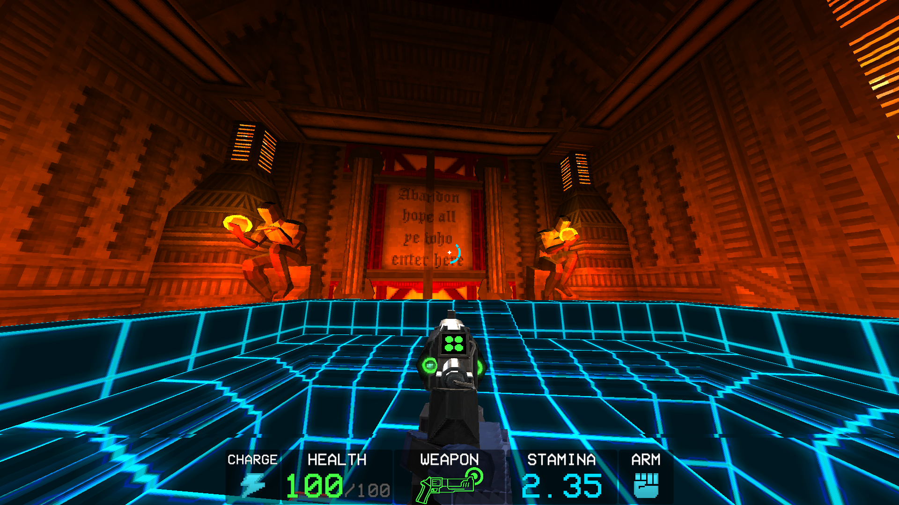
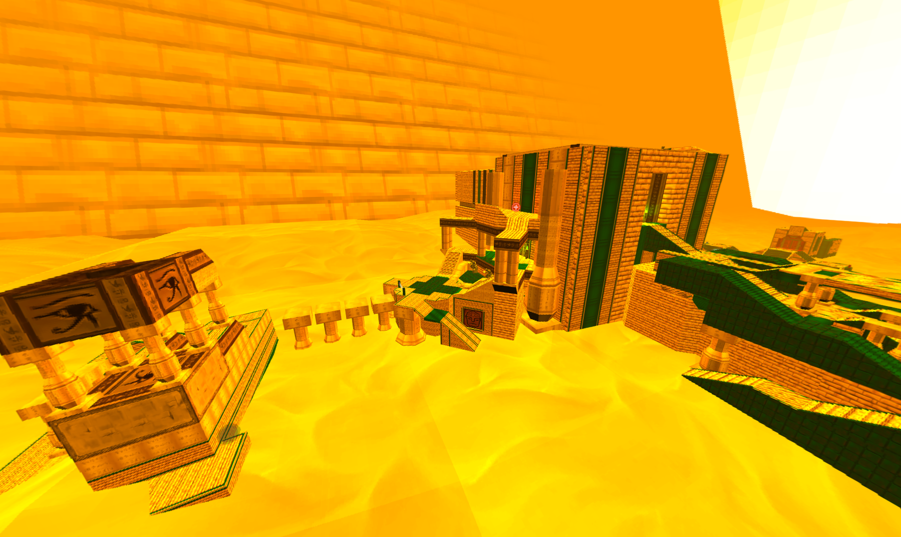
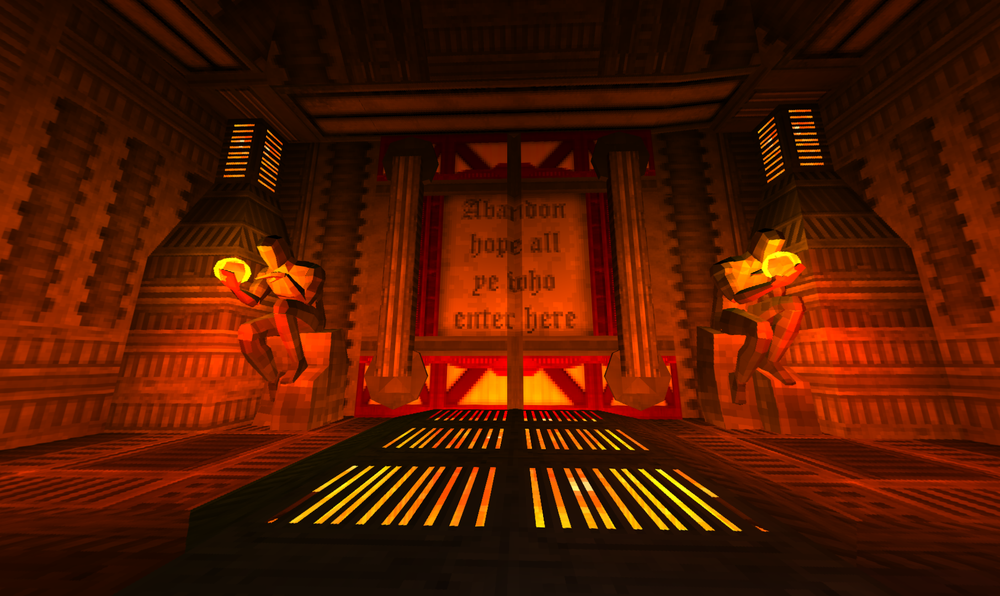
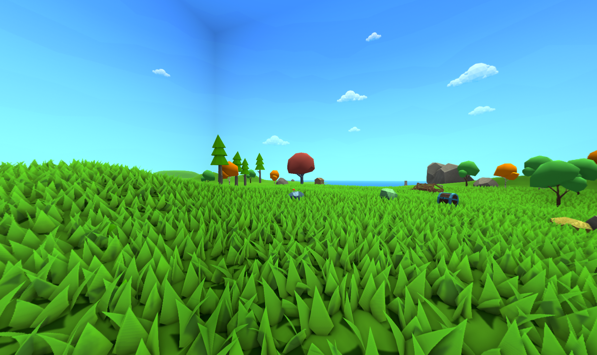

# Cubemap Maker
Create 360 Cubemaps from within Unity games for use in The Cyber Grind

## Usage

Press "F10" to capture a Cubemap

The image will be saved to The ULTRAKILL's Cyber Grind Skybox folder by default, but in edge cases where the plugin could not find this folder (or you aren't planning on using this for ULTRAKILL), it will be saved in a folder in your Pictures directory named "Cubemaps"

You can find the `config.cfg` in `%AppData%/CubemapMaker/`. There you can change the output path, the capture key, the orientation of the cubemap, and the output resolution.

## Orientation Settings

There are 3 orientation settings available:

**- Yaw (Default):** This will capture the cubemap in the direction you're facing but will keep the world upright

**- Accurate:** This will accurately capture rotation in the cubemap, so wherever you are looking will be the forward position. This can create some very disorienting cubemaps, so use with caution! (Or don't, I don't really care tbh)

**- None:** This won't take the camera's orientation into account at all

## Examples (Click to view in 360)

The following was taken in ULTRAKILL's 4-2:

Here is another of the Cerberus Boss Room:

While this plugin was developed with ULTRAKILL in mind, this mod works with most Unity games. This image was taken in the main menu of Muck:

